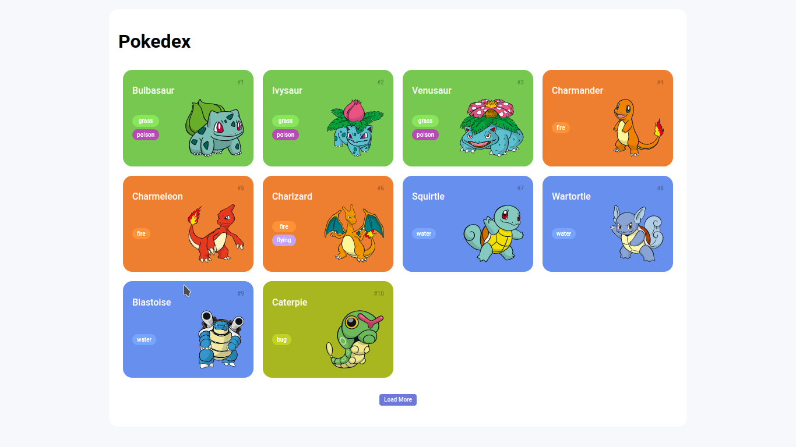

# pokedex

  

## 💻 Projeto

Esta aplicação é fruto do Bootcamp Potência Tech Angular Developer, bootcamp promovido pelo iFood e pela Digital Innovation One.
Neste projeto, foi requisitado a criação de um catálogo digital de pokemons ou 'pokedex' através do consumo de uma API REST.
Para tanto, também deveria ser explorado as tecnologias HTML, CSS, JavaScript e fundamentos do desenvolvimento Web.

## ⚡ Funcionalidades

Principais funcionalidades da aplicação:
- Catálogo digital com imágens e informações sobre personagens do famoso jogo Pokemon.

## 🚀 Tecnologias

Principais tecnologias utilizadas no projeto:
- HTML;
- CSS;
- Javascript.
